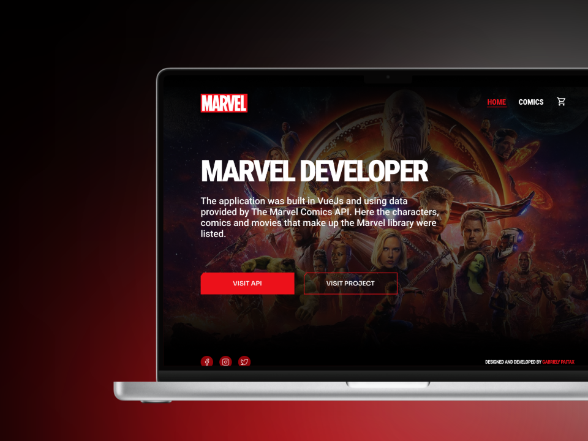
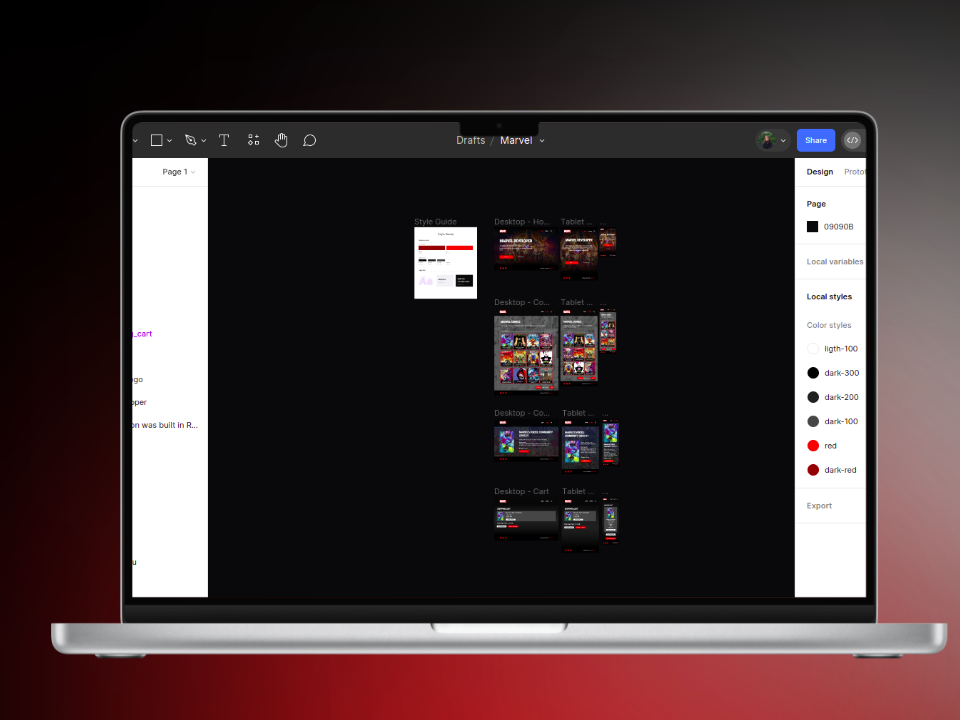

# Marvel 🦸🏻‍♀️

## Welcome! 👋

Thanks for checking out this web development code challenge.

Check this application in:

https://marvel-challange.vercel.app/

## 📝 About

This project is a technical challenge aimed to utilize the Marvel API (https://developer.marvel.com/) to create a Vue application that provides functionalities such as listing, detailing, searching, and shopping cart for comics.

## ⭐ Prototype Screens

The prototype screens for this project can be found on Figma at the following link: [Marvel Figma Prototype](https://www.figma.com/file/eMfhuVwrbHOmHjX1XF3A8s/Marvel?type=design&node-id=0%3A1&mode=design&t=iooWeL6fWkQUmQgJ-1).

## 🚀 How to use the project

Step 1 - Make a clone of the application, access the folder where it is located and enter the application;

Step 2 - Install the project's dependencies using the `npm install` command;

Step 3 - To use the application, you must first create an `.env` file at the root of the website to configure the application's environment variables, copy the variables from env.example and replace the necessary values;

Step 4 - To start the application in the development environment, run the `npm run dev` command. The application will start running on your localhost;

Step 5 - To build your application, run the command `npm run build`.

> [!NOTE]
> Please note that to run the project, Node.js version 18.0 is required. Make sure you are using Node.js 18.0 installed before running the project. 
